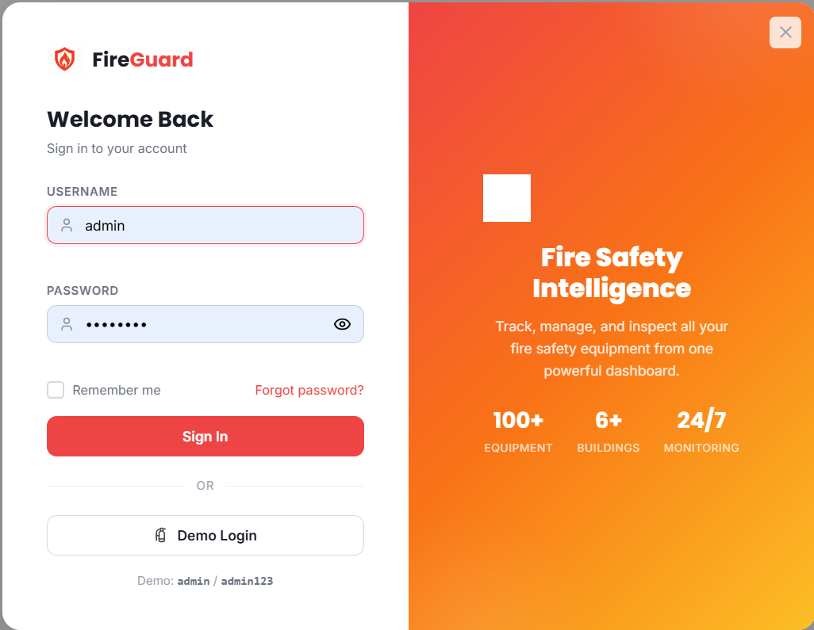
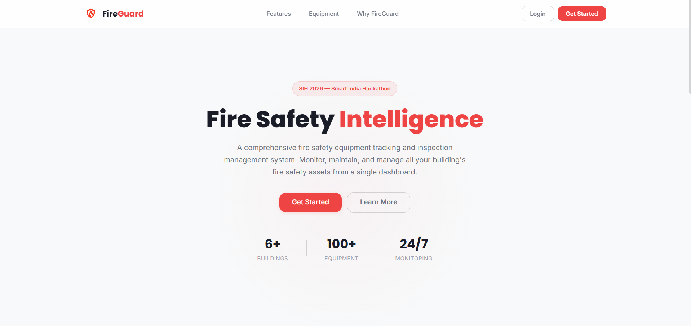
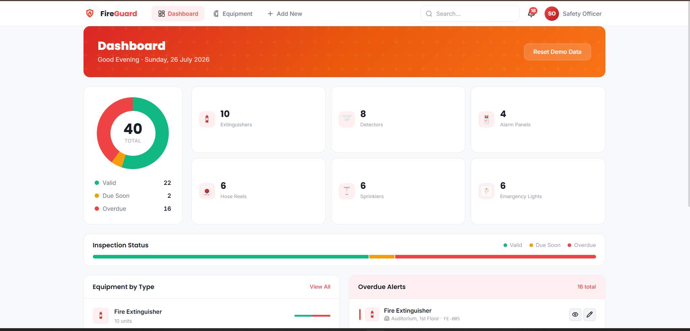

# FireGuard — Fire Safety Equipment Inspection and Expiry Register

**SIH 2026 — Internal Practical Assessment**
VENKATASAARATHY R · Reg 411625104075 · PDKVCET · CSE PDKV · Year II

---

## Problem (2 lines)

Fire extinguishers and safety equipment in institutional buildings carry paper tags showing last inspection dates, but no central list exists — so expired units are discovered during audits or when one is needed and fails. FireGuard is a digital register that tracks every unit, auto-calculates expiry, and alerts the safety officer to overdue equipment.

## Live Demo

**https://fireguardd.netlify.app/**

Login credentials: `admin` / `admin123`

---

## Screenshots

### Landing Page


### Login


### Dashboard


### Equipment List


### Add Equipment


## Demo Video

https://github.com/Venkat-1506/fireguard/assets/demo.mp4

---

## How to Run (Step by Step)

### Option A — Live (no setup needed)
1. Visit https://fireguardd.netlify.app/
2. Log in with `admin` / `admin123`
3. You will see the dashboard with 40 pre-loaded equipment records

### Option B — Local (static frontend only)
1. Clone the repo: `git clone https://github.com/Venkat-1506/fireguard.git`
2. Open the `assets/` folder
3. Start a local server: `python -m http.server 8080`
4. Open `http://localhost:8080` in your browser
5. Log in with `admin` / `admin123`

> **Note:** Must be served over HTTP (not opened as `file://` directly) because the app uses `localStorage` for data persistence, which requires a proper origin.

### Option C — With Flask API backend (optional)
1. `cd fire-safety-register`
2. `pip install -r requirements.txt`
3. `python app.py`
4. The API runs on `http://localhost:5000`

## Pages

| Page | URL | Description |
|------|-----|-------------|
| Landing | `index.html` | Marketing/intro page |
| Login | (modal on landing) | Authenticate with credentials |
| Dashboard | `dashboard.html` | Overview stats, compliance summary, recent alerts |
| Equipment List | `equipment.html` | All records with card/table views, search, filter, pagination |
| Add Equipment | `add-equipment.html` | Step-based form to register new equipment |
| Edit Equipment | `edit-equipment.html` | Update an existing record |

## Field Documentation

Every equipment record has these fields:

| Field | Type | Description | Allowed Values |
|-------|------|-------------|----------------|
| `record_id` | Integer | Auto-increment internal primary key | 1, 2, 3, ... |
| `equipment_id` | String | Human-readable unique ID shown to users | e.g., `FE-001`, `SD-003`, `FAP-002` |
| `type` | String | Equipment category | Fire Extinguisher, Smoke Detector, Fire Alarm Panel, Fire Hose Reel, Sprinkler System, Emergency Light |
| `building` | String | Building location | Main Building, Admin Block, Laboratory Wing, Auditorium, Hostel Block, Workshop |
| `floor` | String | Floor within the building | Basement, Ground Floor, 1st Floor, 2nd Floor, 3rd Floor, 4th Floor, 5th Floor, Rooftop |
| `install_date` | Date | When the equipment was installed (ISO format) | `YYYY-MM-DD` |
| `last_inspection` | Date | Most recent inspection date (ISO format) | `YYYY-MM-DD` |
| `inspection_interval` | Integer | Months between required inspections | 3, 6, or 12 |
| `remarks` | String | Free-text maintenance notes | Any text, may be empty |

## Derived Values (Calculated, Not Stored)

Two values are **never stored** — they are recalculated from the raw fields every time a record is loaded or changed:

### `next_due`
**Formula:** `last_inspection + inspection_interval months`

```
Example: FE-001
  last_inspection = 2026-01-10
  inspection_interval = 6 months
  next_due = 2026-07-10
```

Calculation in code (`data.js:184`):
```javascript
function calculateNextDue(equipment) {
    var lastInspection = new Date(equipment.last_inspection);
    lastInspection.setMonth(lastInspection.getMonth() + equipment.inspection_interval);
    return lastInspection.toISOString().split("T")[0];
}
```

### `status`
**Formula:** Compare `next_due` against today's date

| Condition | Status |
|-----------|--------|
| `next_due < today` | **Overdue** |
| `next_due` is within 30 days of today | **Due Soon** |
| Otherwise | **Valid** |

Calculation in code (`data.js:174`):
```javascript
function calculateStatus(equipment) {
    var today = new Date();
    today.setHours(0, 0, 0, 0);
    var nextDue = new Date(calculateNextDue(equipment));
    var daysUntilDue = Math.ceil((nextDue - today) / (1000 * 60 * 60 * 24));
    if (daysUntilDue < 0) return "Overdue";
    if (daysUntilDue <= 30) return "Due Soon";
    return "Valid";
}
```

### Hand-Verification (Task 5)

Pick **FE-005** (record_id 20):
- `last_inspection` = 2025-05-10
- `inspection_interval` = 6 months
- `next_due` = 2025-11-10
- Today = 2026-07-26
- Days since due = 258 days → **Overdue** ✓

Pick **FE-010** (record_id 38):
- `last_inspection` = 2026-07-15
- `inspection_interval` = 6 months
- `next_due` = 2027-01-15
- Today = 2026-07-26
- Days remaining = 173 days → **Valid** ✓

## Intentional Awkward Cases in Dataset

The 40-record seed dataset includes these edge cases to prove the system handles real-world data:

| Record | Equipment ID | Issue |
|--------|-------------|-------|
| 17 | EL-003 | Empty remarks field |
| 2 | FE-002 | Unusually old install date (2018) |
| 34 | FE-009 | Very old install date (2016), 12-month interval |
| 20 | FE-005 | Significantly overdue (14+ months past due) |
| 1–3 | FE-001, FE-002, FE-003 | Multiple Fire Extinguishers in similar buildings (near-duplicates) |
| 29 | SP-005 | Newly installed, first inspection just passed |
| 31 | EL-005 | Inspection due but remarks note cracked lens |

## Architecture

```
assets/
├── index.html              # Landing page
├── dashboard.html          # Dashboard with stats
├── equipment.html          # Equipment list (card + table views)
├── add-equipment.html      # Add new record (step-based form)
├── edit-equipment.html     # Edit existing record
├── css/
│   ├── components.css      # Design tokens, reset, shared components
│   ├── dashboard.css       # Dashboard-specific styles
│   ├── equipment.css       # Equipment list + app shell
│   ├── form.css            # Add/edit form styles
│   ├── landing.css         # Landing page styles
│   ├── login.css           # Login modal styles
│   └── responsive.css      # Mobile breakpoints
├── js/
│   ├── app.js              # Shared logic, auth guard, notifications
│   ├── data.js             # Data layer: seed data, CRUD, localStorage
│   ├── dashboard.js        # Dashboard rendering
│   ├── equipment.js        # Equipment list rendering
│   ├── form.js             # Add/edit form logic
│   ├── landing.js          # Landing page interactions
│   └── login.js            # Login authentication
├── icons/                  # SVG icons
├── images/                 # Equipment illustrations, logos
└── fire-safety-register/   # Optional Flask API backend
    ├── app.py              # Flask REST API with SQLite
    ├── requirements.txt
    └── ...
```

## Tech Stack

- **Frontend:** Vanilla HTML, CSS, JavaScript (no frameworks)
- **Data persistence:** `localStorage` (browser) with seed data fallback
- **Backend (optional):** Python Flask + SQLite
- **Fonts:** Poppins (headings) + Inter (body) via Google Fonts
- **Icons:** Custom SVG icons
- **Hosting:** Netlify (static frontend)

## What Is Not Finished

- No real authentication system (hardcoded admin/admin123)
- No email/SMS notifications for overdue equipment
- No PDF export or print-friendly view
- No multi-user support or role-based access
- The Flask backend (`fire-safety-register/`) is a separate prototype — not connected to the frontend
- No historical inspection log (only stores the most recent inspection date)
- No image upload for equipment photos

## License

This project was built for the SIH 2026 Internal Practical Assessment at PDKVCET.
